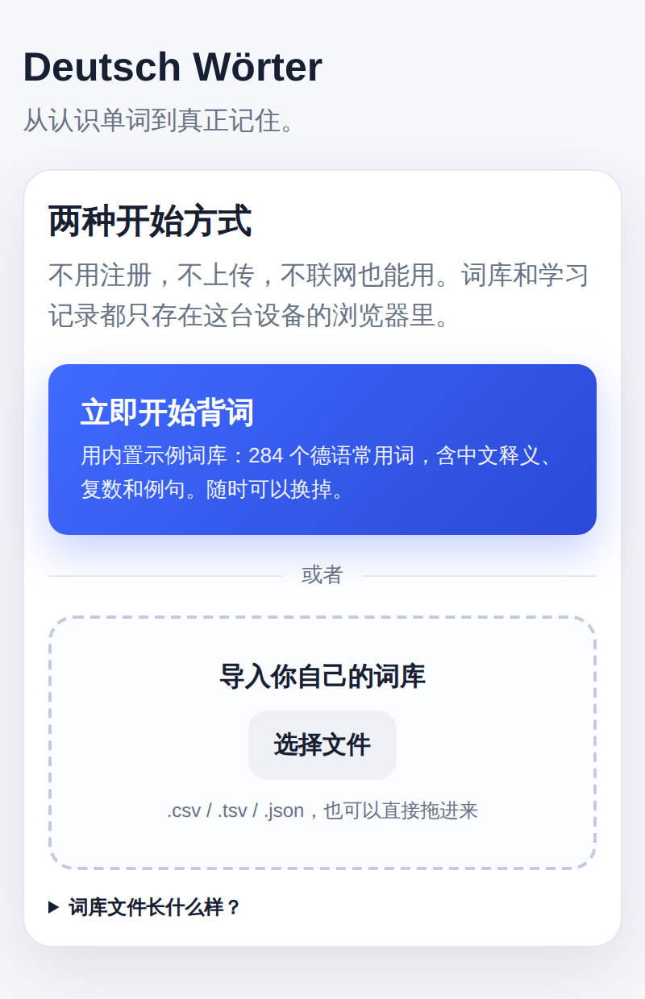
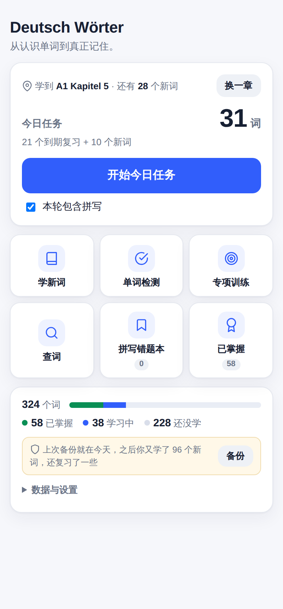
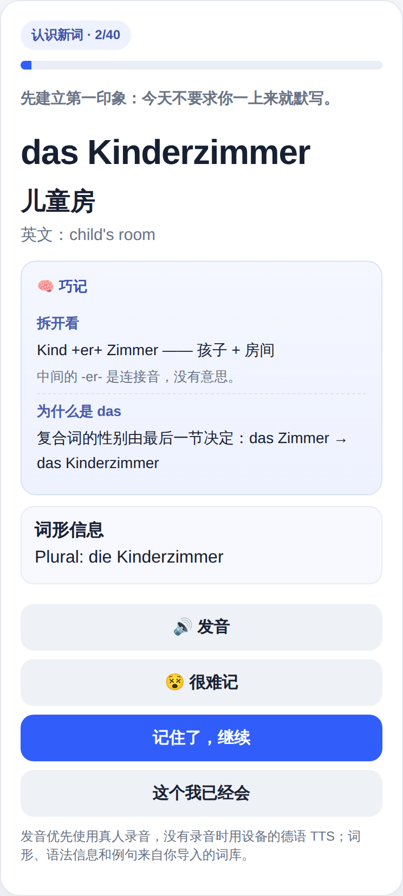
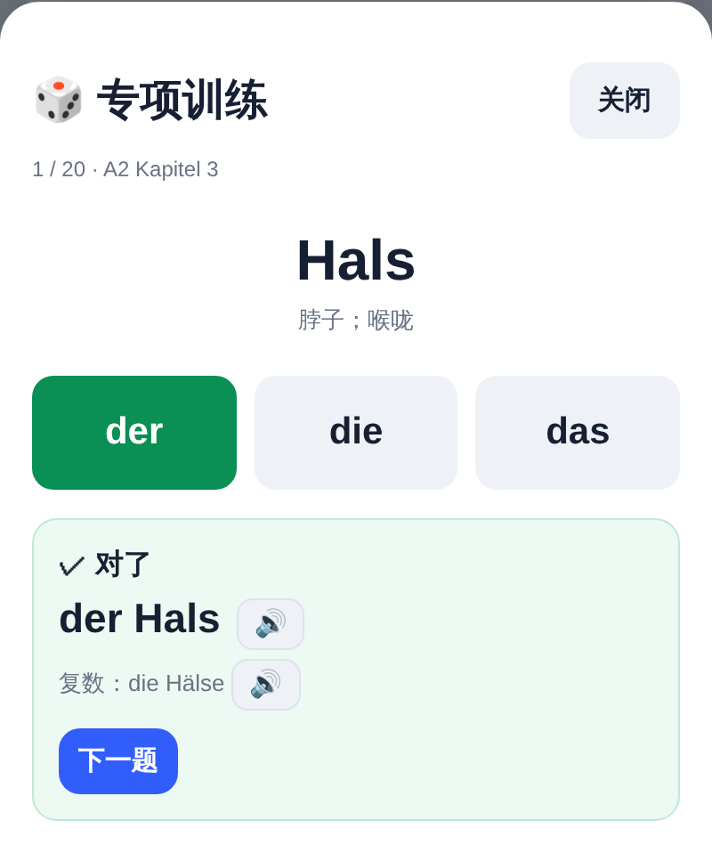

<div align="center">

# Deutsch Wörter

**A German vocabulary trainer that brings your own word list, works offline, and never sends anything anywhere.**

[**▶ Open the app**](https://vittoriocai.github.io/deutsch-woerter/) · no account, no install, no upload

[](LICENSE)
[](https://github.com/VittorioCai/deutsch-woerter/actions/workflows/deploy.yml)


[中文说明](README.zh-CN.md)

</div>

> **Note on language:** the interface is in Chinese — it was built for Chinese speakers learning German. The vocabulary you import can be in any language pair you like.

---

<table>
<tr>
<td width="50%"><br><sub><b>Nothing to set up.</b> One tap loads a built-in 284-word starter deck, or drop in your own CSV.</sub></td>
<td width="50%"><br><sub><b>One button a day.</b> Everything due for review across every chapter, plus a few new words.</sub></td>
</tr>
<tr>
<td width="50%"><br><sub><b>Why the word is what it is.</b> Gender from the ending, compounds taken apart, plurals derived — computed from the word, for any deck.</sub></td>
<td width="50%"><br><sub><b>Drills for what spelling checks miss:</b> der/die/das, plural forms, dictation.</sub></td>
</tr>
</table>

## Why this exists

Every vocabulary app wants an account, a subscription, and your study data on their
server — and none of them has *your* word list, the one your course actually uses.
This one inverts that: **you bring the words, it stays on your device, and the code
is yours to read.**

That is also why it ships with no textbook vocabulary. Publishing an app is not a
licence to redistribute somebody's glossary. What it does ship is a 284-word
starter deck written for this project, so the app is useful the second you open it.

## What it does

- **今日任务 — the daily button.** Everything due for review across all chapters
  plus a few new words, in one session. Spaced repetition is supposed to decide
  what you study; the chapter pickers are there when you want them, not on the
  daily path.
- **学新词 — staged learning.** Meet the word → recognise its meaning → recall the
  German → spell it, with spaced review in between. Spelling can be switched off
  for a recognition-only session; those words still advance through the review
  intervals but cannot reach 已掌握, which here means *you can produce the word*,
  not just recognise it.
- **单词检测 — the quiz.** Weak words first, both directions, spelling checked,
  articles optional or strict.
- **专项训练 — targeted drills.** der/die/das, plural forms derived from the grammar
  column, and dictation. These test the things a spelling check quietly accepts.
- **Real pronunciation.** Native recordings from [Wikimedia
  Commons](https://commons.wikimedia.org/) where they exist (~90% of common words),
  cached after first play; otherwise the best German voice the device has, ranked
  so it stops picking the robotic compact one.
- **A wrong-book that explains itself.** Missed spellings are grouped by *why* —
  missing umlaut, wrong article, near-miss — not just listed.
- **Explanations, not just answers.** German gender is largely predictable from
  the ending, a compound takes the gender and plural of its last element, and verb
  prefixes carry meaning — so the app *derives* the explanation from the word
  rather than storing one next to it. `die Wohnung` gets "-ung is feminine,
  plural -en, and here are four more"; `das Kinderzimmer` gets taken apart into
  Kind +er+ Zimmer with its gender read off `das Zimmer`. It costs no bytes, works
  offline, and works on **any** deck you import — not only on words somebody
  pre-wrote.
- **Installable and offline.** Add it to the home screen; it works on a plane.

## Bring your own word list

Import from the first screen, or 更换词库 later. Two formats.

**A spreadsheet saved as CSV or TSV.** First row is a header. Only `de` is
required, plus at least one of `zh` / `en`:

```csv
de,zh,en,level,chapter,grammar,example
das Haus,房子,house,A1,1,Plural: die Häuser,Das Haus ist sehr alt.
die Tür,门,door,A1,1,Plural: die Türen,
```

| Column | Meaning |
| --- | --- |
| `de` | the German word, with its article for nouns — **required** |
| `zh` | Chinese meaning, shown as the primary gloss |
| `en` | English meaning, used by the quiz and as a fallback gloss |
| `level` | any label you like (`A1`, `B2`, `Beruf`…) — defaults to `A1` |
| `chapter` | any label — defaults to `1` |
| `grammar` | plural, e.g. `Plural: die Häuser`, or the compact `-en` / `"-e` (`"` = umlaut) |
| `example` | a sentence shown with the word |

Header names in German, English and Chinese are all accepted (`Deutsch`,
`Kapitel`, `中文`, `释义`…).

**JSON**, which is what 导出词库 writes:

```json
{"name":"Mein Wortschatz","cards":[{"de":"das Haus","zh":"房子","level":"A1","chapter":"1"}]}
```

[`src/starter-deck.json`](src/starter-deck.json) is a complete working example.

Rows that can't be used are listed before the import goes ahead, never dropped
quietly. Keep the row order stable: a word listed twice in the same chapter is
told apart from its twin by its position.

## Your data

Progress, the spelling wrong-book and the mastered archive live in
`localStorage`; the word list lives in IndexedDB. Nothing is sent anywhere — which
also means nothing is backed up for you:

- **导出学习记录** writes a JSON backup. Do it now and then; a browser that clears
  site data takes your history with it. The app nags after 30 days.
- **导入学习记录** merges by default (newer record wins per word) rather than
  replacing, so restoring a backup from another device cannot wipe this one.
- **导出词库** writes your word list back out. Keep it somewhere your phone can
  reach; you need it again on every new device.

Progress is keyed by a hash of `level|chapter|de`, never by a row number, so
adding or removing words disturbs nothing you have already learned — and a word
that exists in two different decks keeps its history across a swap. The hash is
computed identically in the browser and in `tests/data.test.ts`, with the expected
values pinned as literals: **if that test ever needs updating, somebody's learning
history has just been orphaned.**

## Local development

```sh
npm ci
npx playwright install chromium   # --with-deps on Linux
npm run dev                       # builds, then serves dist/ at 127.0.0.1:4321
npm run verify                    # tsc + vitest + build + playwright — the CI gate
npm run screenshots               # regenerate the images above
```

The end-to-end suite brings its own small made-up deck
([`tests/fixtures/deck.json`](tests/fixtures/deck.json)) and imports it through the
app's own parser, so a broken import turns the whole suite red. It never touches
the network: Wikimedia is stubbed, because a test that quietly tests something
different depending on where it runs is worse than no test.

## Structure

`scripts/build.mjs` turns everything in `src/` into the files the page loads,
written to `dist/`. It runs as part of `npm run dev`, `npm test` and
`npm run build`; `dist/` is never committed.

| Edit | Generated into `dist/` |
| --- | --- |
| `src/index.html`, `learn.css`, `icon.svg`, `app.webmanifest`, `starter-deck.json` | copied as-is |
| `src/learn.core.js`, `insight.js`, `wrongbook-addon.js`, `mastered-addon.js`, `drills-addon.js`, `md5.js` | `learn.js` |
| `src/store.js` | `store.js` |
| `src/deck.js` | `deck.js` |
| `src/sw.source.js` | `sw.js` |

`src/store.js` owns every read and write to `localStorage`. Writes are batched, so
anything that reads its own state back must keep an in-memory copy and merge into
that — re-reading storage inside a flush window sees a stale value and silently
drops the pending change.

`src/insight.js` holds the explanation rules. Only near-exceptionless ones are
stated as facts, the words that merely *end* in those letters are listed out by
hand, and when nothing solid applies it returns nothing: an invented explanation
is worse than a blank panel. It never contradicts the deck — a rule that
disagrees with the article the card carries stays silent, and a test enforces it.

`src/deck.js` owns the word list: parsing, the card ids, IndexedDB. It implements
SHA-256 by hand rather than calling `crypto.subtle`, which is unavailable outside a
secure context and asynchronous on top; one code path that always produces the same
digits matters more here than native speed, because those digits are how your
progress finds its words.

The service worker's cache name is derived from the content it caches, so a deploy
can never leave a returning visitor pinned to stale JavaScript.

## Licence

[MIT](LICENSE) — the code and the starter deck. Any word list you import is yours
and stays yours.
